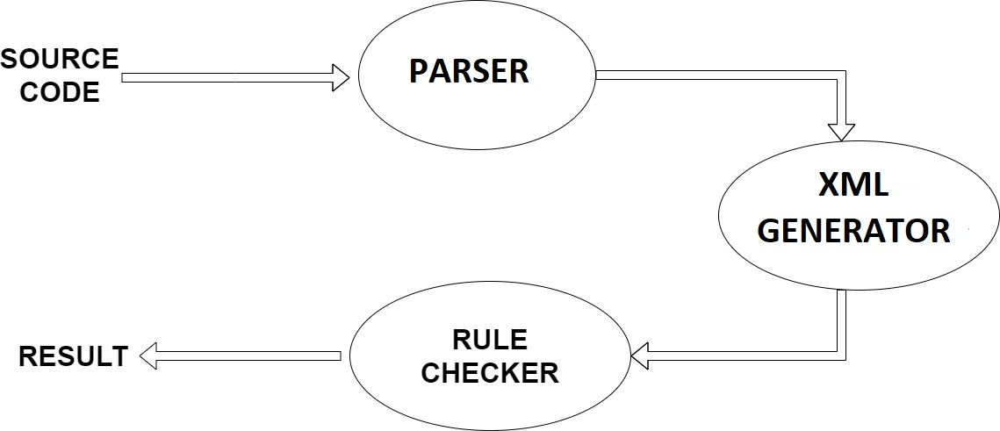
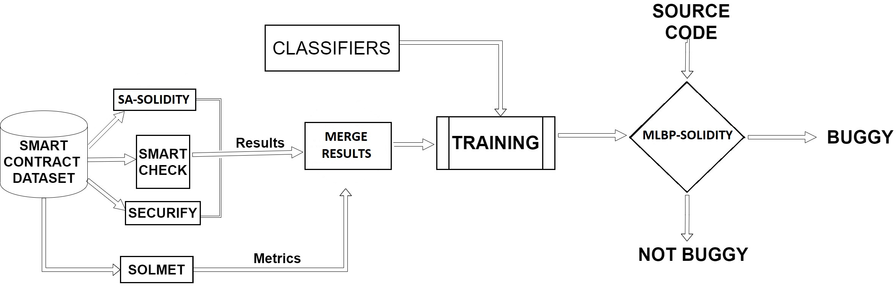
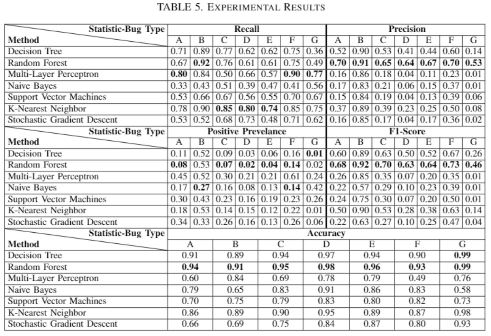

## DETECTING BUGS IN SMART CONTRACTS USING STATIC ANALYSIS AND BUG PREDICTION

### Author Information

[Ahmet GUL](https://github.com/ahmetgul93) - Bogazici University

[Yavuz KOROGLU](https://www.cmpe.boun.edu.tr/~yavuz.koroglu/) - Bogazici University

[Alper SEN](https://www.cmpe.boun.edu.tr/~sen/) - Bogazici University

### Abstract
As  blockchain  solutions  become  widespread,  iden-tifying  potential  bugs  in  smart  contracts  written  in  Solidity language  will  be  crucial  for  these  solutions  to  work  correctly.To accurately detect these bugs, the developer must use several state-of-the-art bug detection tools and investigate the potential bugs they report. In this study, we first show that one tool is not enough to detect all the bugs as our Static Analysis for Solidity tool  (SA-Solidity)  and  the  known  SmartCheck  and  Securify tools identify different bugs in SmartEmbed’s experimental setof smart contracts. Then, we develop Machine Learning-based Bug  Predictor  for  Solidity  (MLBP-Solidity)  which  predicts files  that would  be  reported  by all  the  previous bug  detection tools.  MLBP-Solidity  eases  the  burden  on  the  developer  by allowing  him/her  to  focus  on  a  subset  of  files  that  are  most probably  buggy.  Our  experimental  results  show  that  MLBP-Solidity  achieves  91-99%  accuracy,  depending  on  the  type  of predicted  bug.

### Overview

1) We   develop   Static   Analysis   for   Solidity   (SA-Solidity) tool to detect bugs in smart contracts. We show that SA-Solidity and the two known bug detectors,  SmartCheck  and  Securify,  detect  different bugs  in  SmartEmbed’s  experimental  set  of  smart contract files.
2) We  implement  and  train  Machine  Learning  based Bug  Predictor  for  Solidity  (MLBP-Solidity).  To best  of  our  knowledge,  this  the  first  predictive model  trained  for  bug  prediction  in  Solidity  language.
3) We   predict   seven   different   types   of   bugs   in SmartEmbed’s  experimental  set  of  smart  contract files.  Our  experimental  results  show  that  MLBP-Solidity  achieves  91-99%  accuracy,  depending  on the type of predicted bug.

### Bugs In Smart Contracts

### A. Locked Money
Locked  Money  is  about  violation  of  natural  business logic  of  smart  contracts.  A  contract  which  receive  Ether should  implement  a  way  to  send  Ether.  Otherwise,  Ether would  be  locked  in  contract. 
```
pragma solidity 0.4.12;
contract Foo {
    function deposit() payable {
        require(msg.value > 0);
    }
}
```
### B. Reentrancy
Reentrancy   attack   caused   the   most   money   lose   in Ethereum history. Smart contracts are state machines. When the contract does not update its state before sending the fund, the attacker may call the withdrawal function continuously to evacuate the contract’s funds.
```
pragma solidity ^0.4.12;
contract Foo {
 mapping(address => uint) balances;
 function withdraw() {
   uint x = balances[msg.sender]; 
   if (msg.sender.send(x))
	  balances[msg.sender] = 0;
  }
}
```

### C. Overflow/Underflow
The  main  reason  of  Overflow/Underflow  attack  is  the limitation of EVM. EVM uses 256 bits as number size. Any uncontrolled  arithmetic  operation  may  cause  new  value  tobe out of range.
```
contract Foo {
mapping (address => uint256) public balances;
function InsecureTransfer(address _to, uint256 _value) {
    /* Check if sender has balance */
    require(balances[msg.sender] >= _value);
    /* Add and subtract new balances */
    balances[msg.sender] -= _value;
    balances[_to] += _value;
  }
}
```

### D. Unrestricted Write
There are two types of variables which are state and local in  Solidity  language.  When  state  variables  are  accessible for  all  accounts,  it  may  make  them  vulnerable  to  change.
```
pragma solidity ^0.4.14;
contract Foo {
    address owner;
    function beOwner(address _newOwner) {
        owner = _newOwner;
    }
}
```
### E. Revert Usage
It  is  better  to  check  condition  with  "require"  instead of  "revert"  inside  "if  condition"  due  to  having  better  code readibility.
```
pragma solidity ^0.5.0;
contract Foo {
    function checker() public returns (bool) {
        if (msg.sender < 5) {
            revert();
        }
    }
}
```

### F. Transaction Ordering Dependency
Every function in a contract can be considered as transaction. It should be considered that ordering of transaction may  change  the  Ether  transferred  or  the  receiver.  For example, variable price can be set in different transaction and this may change the number of Ether to transfer. Variable  owner  can  also  be  set  in  different  transaction  which may change to receiver of Ether.
```
contract Foo {
    uint price = 10;
    address owner;
    
    function beOwner(address _newOwner) {
        owner = _newOwner;
    }

    function setPrice(uint newPrice) {
        if (msg.sender == owner)
            price = newPrice;
    }

    function sendMoney() {
        owner.transfer(price);
    }
}
```

### G. Unhandled Exception
There  are  different  functions  to  send  Ether  in  Solidity. These are "call", "send", and "transfer". We suggest to use transfer  function  to  do  it.  Because,  transfer  automatically throws  exception  if  the  process  fails.  Other  functions  do not handle exceptions.
```
contract Foo {
    function etherTransfer(address _receiverAddress, uint256 amount){
        _receiverAddress.send(amount);
    }
}
```
### Methodology

  SA-Solidity   contains 3 modules, PARSER,  XML  GENERATOR,  and  RULE CHECKER.  SA-Solidity  takes  source  code  of  the  smart contract  as  input.  The  PARSER  module  in  SA-Solidity converts these contracts to JSON parse tree by using Solidity Antlr  parser.  Then,  the  XML  GENERATOR  module converts  the  parse  tree  to  an  XML  tree.  The  purpose  of the  conversion  process  is  to  run  XPath  on  XML  which allows  SA-Solidity  to  create  flexible  queries.  Finally,  the RULE  CHECKER  module  queries  the  XML  trees  with XPath  queries  to  identify  bugs  and  reports  the  results  to the user.


  MLBP-Solidity  is  a  machine  learning  model  to  predict specific  bugs  on  Solidity  source  codes.  It  is  trained  by using SmartEmbed’s Solidity source code dataset. In order to  label  the  data,  we  analyzed  using  three  different  static analysis tool SA-Solidity, SmartCheck, and Securify. Apart from  these,  source  code  metrics  are  collected  by  Solmet. After this process, labelled data and source code metrics are merged.  Thus,  we  obtained  a  consolidated  data  processed with results from different tools. After these steps, different classifiers  were  used  on  the  data  to  train  the  model.  As  a result  of  this,  MLBP-Solidity  decide  whether  the  Solidity source code is buggy or not
  The  training  phase  of  MLBP-Solidity  uses  the  known synthetic  minority  over-sampling  technique  (SMOTE) to get rid of imbalances in the training data. MLBP-Solidity uses the imbalanced-learn package as the implementation of SMOTE. MLBP-Solidity  trains  Decision  Tree,  Random  Forest, Multi-Layer  Perceptron,  Naive  Bayes,  Support Vector Machines, K-Nearest Neighbour, Stochastic Gradient Descent, and  Gradient  Descent  as  classifiers.  These  classifiers are availably at the Scikit-learn Python library.
  
### Evaluation of Bug Detection Tools

We  evaluate  the  results  of  our  bug detection  tool,  SA-Solidity,  and  the  known  bug  detection tools, SmartCheck and Securify. There are 8267 files in the SmartEmbed’s  dataset  for  which  some  of  the  tools  fail  to terminate. For the sake of fairness, we do not consider these files in our evaluation and take only 14458 files out of 22725 into account.
All the three bug detection tools report different files as buggy.  All  these  bug  detectors  identify  bugs  by  checking violations  of  different  sets  of  rules  in  source  code  level. Bug detectors focus on different rule violations. Hence, they detect different bugs in the source code. Using all the rule  violations  or  all  the  three  bug  detectors  would  be  too complex  and  time  consuming. This  is  why,  we  train  MLBP-Solidity  to  predict  bugs  where  all  tools would  find  a  bug.  So,  the  developer  would  have  a  quick solution  to  find  the  most  probable  bugs  before  making  a comprehensive analysis with bug detectors.

### Evaluation of MLBP-Solidity

We  train  a  bug  prediction  model  for MLBP-Solidity. Since we do not compare the bug detection tools, we now use all the 22725 files in the SmartEmbed’s dataset. We label each file in the SmartEmbed’s dataset as buggy iff all bug  detectors  that  can  process  that  file  reports  the  file  as buggy.  Otherwise,  we  label  the  file  as  not-buggy.  We  use 5-fold  cross  validation  to  divide  the  labeled  dataset  into training  and  test  sets.  In  every  fold,  we  use  the  known synthetic  minority  over-sampling  technique  (SMOTE) to get rid of imbalances in the training data. We picked the imbalanced-learn package for implementing SMOTE. 
For every fold, we train seven classifiers, Decision Tree, Random Forest, Multi-Layer Perceptron, Naive Bayes, Support  Vector  Machines,  K-Nearest  Neighbor,  and  Stochastic  Gradient  Descent.  We  calculate Recall, Precision, Accuracy, Positive Prevalance and F1-Scores and  take  the  average  of  all  the  five  folds  to measure classifier performance.


  
### Conclusion

We  developed  Machine  Learning-based Bug  Predictor  for  Solidity  MLBP-Solidity. MLBP-Solidity predicts bugs that would be reported by multiple bug detectors; SA-Solidity, Securify, and SmartCheck. It is a practical tool for the developer/tester as the state-of-the-art bug detectors  cannot  check  all  the  bugs  and  produce  false  positives. Our experimental results show that MLBP-Solidity achieves 91-99%  accuracy,  depending  on  the  type  of  predicted  bug. As future work, based on the new developments in language, we  plan  to  expand  our  rule  set  and  data  metrics  for  ourbug  detector,  SA-Solidity.  We  will  also  evaluate  ensembleclassifiers such as majority voting between Random Forest,Multi-Layer Perceptron, and K-Nearest Neighbor.
  
